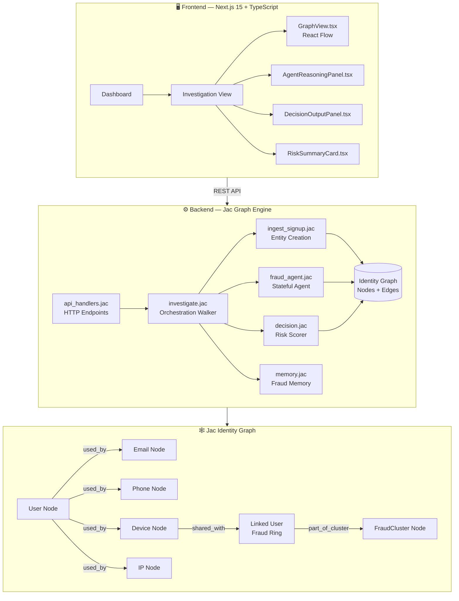
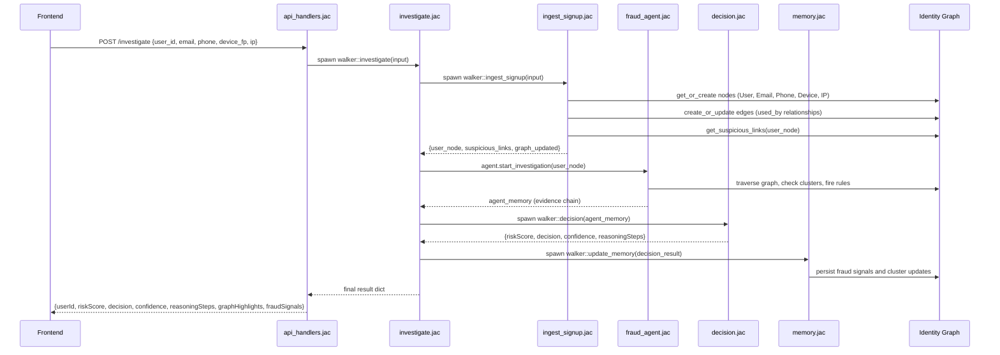
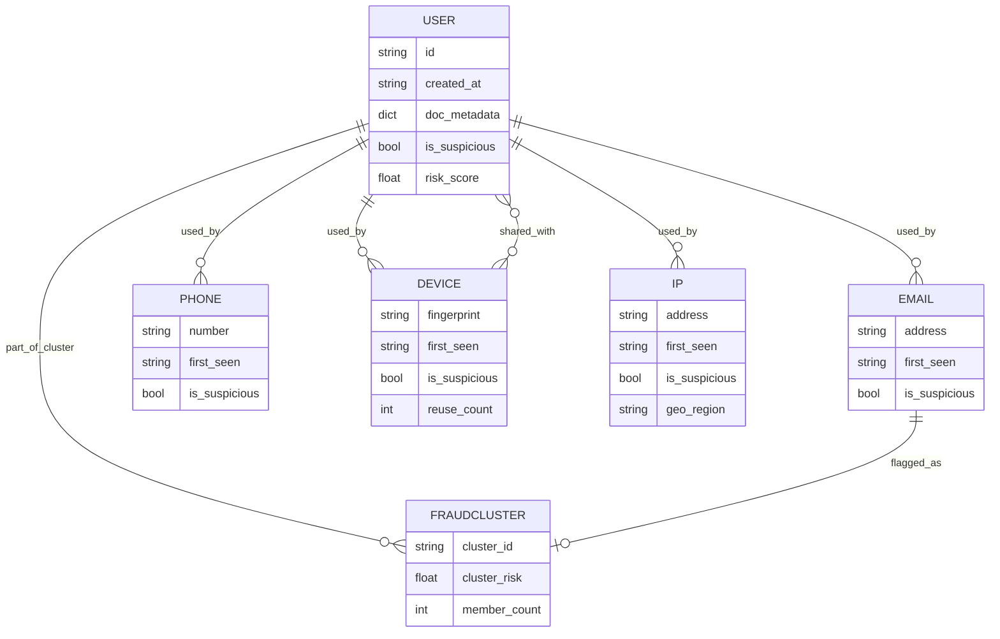
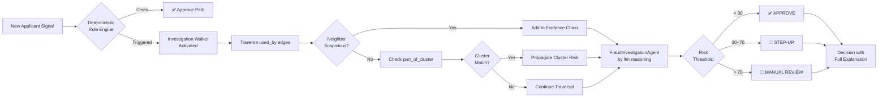
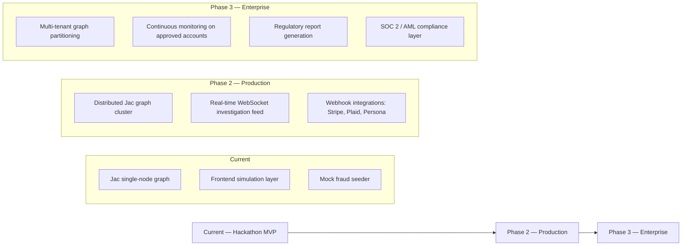

<div align="center">

# 🔍 SignalKYC

### *The Autonomous KYC Investigation Agent — Built on Jac Graph Intelligence*

> **"Don't score identities. Investigate them."**

[](https://www.jac-lang.org/)
[](https://jachai.devpost.com/)
[]()
[](https://nextjs.org/)
[](https://www.typescriptlang.org/)
[]()
[]()

---

**SignalKYC** is a graph-native, agentic KYC fraud investigation platform that replaces static pass/fail identity checks with autonomous multi-hop graph traversal, real-time entity linking, and explainable AI-generated case decisions — built end-to-end in **Jac**, the world's first agentic programming language.

**[Live Demo](#demo-flow) · [Architecture](#architecture) · [Installation](#installation) · [Judges Guide](./JUDGES.md) · [Demo Script](./DEMO.md)**

</div>

---

## 🚨 The Problem: KYC Is Fundamentally Broken

Modern fintech onboarding is trapped in an impossible tradeoff:

| The Strict Path | The Fast Path |
|---|---|
| High friction, slow approval | High speed, high fraud exposure |
| Legitimate users abandoned | Fraud rings slip through |
| Analysts buried in manual reviews | Signals missed across accounts |
| No explainability on decisions | Compliance risk escalates |

**The root cause isn't verification — it's investigation.**

Identity fraud is never contained in one field. Fraud rings, synthetic identities, and mule accounts only become visible when signals are **connected across email, phone, device, IP, documents, session behavior, and prior applications**. No flat tabular checklist catches what a graph can see.

> 📊 Manual remediation is one of the largest pain points in KYC operations. When evidence lives across disconnected systems, analysts spend hours chasing documentation instead of making decisions.

**The critical gap**: fintech teams lack an *explainable investigation layer* — a system that can link fragmented identity signals, reason over them as a live case, and recommend the right next action without routing every ambiguous application into slow, expensive manual review.

---

## 💡 Solution: SignalKYC — Graph-Native Autonomous Investigation

SignalKYC treats every KYC application not as a form to score, but as a **case to investigate**.

```
📨 New Signup → 🕸️ Live Identity Graph → 🤖 Agentic Walker Investigation → 📋 Explainable Decision
                                                                              ✅ APPROVE
                                                                              🔐 STEP-UP VERIFICATION
                                                                              🚩 MANUAL REVIEW
```

### What Makes It Agentic

SignalKYC's core logic is implemented as **Jac walkers** — agents that physically traverse a live identity graph, following edges between entities, accumulating evidence, comparing against historical fraud clusters, and building a readable decision trail. This is not a single API call dressed up as an agent. The walker literally *walks* the graph.

---

## 🏆 Key Innovation

### Why This Cannot Be Replicated With Conventional Architecture

| Dimension | Traditional KYC | SignalKYC |
|---|---|---|
| Data model | Flat records per user | Live property graph of linked entities |
| Decision logic | Rule engine on isolated fields | Walker traversal across multi-hop relationships |
| Fraud detection | Threshold scoring | Cluster membership + propagation analysis |
| Explainability | Score + reason code | Full reasoning chain with node/edge evidence |
| Agent behavior | None | Stateful `FraudInvestigationAgent` with memory |
| Investigation | Manual analyst review | Autonomous graph walker investigation |
| Ongoing risk | One-time check | Continuous memory + linked reassessment |

### Why Jac Is the Right Language

Jac's graph-native primitives — **nodes**, **edges**, and **walkers** — map directly onto the product's architecture. The code structure *is* the product story:

- `nodes.jac` → identity entities (User, Email, Phone, Device, IP, FraudCluster)
- `edges.jac` → relationships (used_by, linked_to, flagged_as, part_of_cluster)
- `walkers/*.jac` → autonomous investigation agents traversing those relationships
- `agents/fraud_agent.jac` → stateful orchestrator with `by llm()` reasoning

The result: an architecture where graph intelligence isn't bolted on — it *is* the architecture.

---

## 🏗️ Architecture

### System Overview



---

### Request Flow — Onboarding Investigation



---

### Identity Graph — Entity Relationship Model



---

### Fraud Cluster Detection Flow



---

## 📁 Repository Structure

```
signalKYC/
│
├── 📂 Backend/                         # Jac graph engine
│   ├── 📂 models/
│   │   ├── nodes.jac                   # Entity definitions: User, Email, Phone, Device, IP, FraudCluster
│   │   └── edges.jac                   # Relationship types: used_by, linked_to, flagged_as, part_of_cluster
│   │
│   ├── 📂 walkers/
│   │   ├── ingest_signup.jac           # Signal ingestion → node/edge creation walker
│   │   ├── build_graph.jac             # Entity normalization and linkage walker
│   │   ├── investigate.jac             # 🧠 Master orchestration walker (full pipeline)
│   │   ├── decision.jac                # Risk scoring, confidence, output formatting
│   │   ├── memory.jac                  # Long-term fraud memory persistence
│   │   └── api_handlers.jac            # HTTP endpoint exposure for frontend
│   │
│   ├── 📂 agents/
│   │   └── fraud_agent.jac             # 🤖 Stateful FraudInvestigationAgent (by llm() reasoning)
│   │
│   ├── 📂 data/
│   │   └── seed.jac                    # Historical fraud data seeder
│   │
│   ├── 📂 utils/
│   │   └── helpers.jac                 # Graph traversal helpers, risk calculators
│   │
│   └── main.jac                        # Server entry point, module loader
│
├── 📂 Frontend/                        # Next.js 15 application
│   ├── 📂 app/
│   │   ├── 📂 investigation/[id]/
│   │   │   └── page.tsx                # Dynamic investigation detail view
│   │   ├── 📂 case/[id]/
│   │   │   └── page.tsx                # Case file view
│   │   ├── 📂 settings/
│   │   │   └── page.tsx                # System configuration
│   │   ├── layout.tsx                  # Root layout with sidebar + header
│   │   ├── page.tsx                    # Dashboard home
│   │   └── globals.css                 # Design system tokens (dark theme)
│   │
│   ├── 📂 components/
│   │   ├── 📂 dashboard/
│   │   │   ├── OverviewCards.tsx       # KPI cards: investigations, risk distribution
│   │   │   └── RecentInvestigations.tsx # Live investigation feed table
│   │   │
│   │   ├── 📂 investigation/
│   │   │   ├── GraphView.tsx           # 🕸️ React Flow identity graph renderer
│   │   │   ├── AgentReasoningPanel.tsx # Step-by-step agent thought process display
│   │   │   ├── RiskSummaryCard.tsx     # Risk score, confidence, category
│   │   │   └── DecisionOutputPanel.tsx # Final decision + explanation renderer
│   │   │
│   │   ├── 📂 ui/                      # shadcn/ui component library
│   │   │   ├── Button.tsx
│   │   │   ├── Card.tsx
│   │   │   ├── Badge.tsx
│   │   │   ├── Slider.tsx
│   │   │   ├── Skeleton.tsx
│   │   │   └── Tabs.tsx
│   │   │
│   │   └── 📂 layout/
│   │       ├── Header.tsx              # Top navigation bar
│   │       └── Sidebar.tsx             # Navigation sidebar
│   │
│   ├── 📂 lib/
│   │   ├── utils.ts                    # cn() class merge utility
│   │   ├── mockData.ts                 # Investigation graph data generator
│   │   └── agentSimulation.ts          # Frontend agent reasoning simulation engine
│   │
│   ├── 📂 store/
│   │   ├── investigationStore.ts       # Zustand: active investigation state
│   │   └── settingsStore.ts            # Zustand: system settings
│   │
│   ├── 📂 types/
│   │   └── index.ts                    # TypeScript interfaces: IdentityNode, IdentityEdge,
│   │                                   #   Investigation, AgentStep, RiskSummary
│   │
│   ├── tailwind.config.js
│   ├── next.config.js
│   └── package.json
│
└── README.md
```

---

## 🧠 Technical Deep Dive

### Graph Traversal & Fraud Propagation

The core of SignalKYC's intelligence lives in `investigate.jac` and `fraud_agent.jac`. When a new application enters the system, the investigation walker does not evaluate the applicant in isolation — it follows the graph:

**Step 1 — Entity Resolution**
`ingest_signup.jac` calls `get_or_create_*` for every signal. If an email, device, or IP already exists in the graph from a previous application, it is *linked* to the current applicant rather than duplicated. This immediately connects the applicant to their full network history.

**Step 2 — Suspicious Link Discovery**
```
for neighbor in user_node -[used_by]-> node {
    if neighbor.is_suspicious → flag with reason
    if neighbor -[part_of_cluster]-> FraudCluster → propagate cluster risk
}
```

**Step 3 — Deterministic Rule Firing**
High-signal patterns trigger investigation before the agent runs:
- `fraudmail.com` / `tempmail` / `10minutemail` → email immediately flagged suspicious
- Device shared with >1 previously escalated user → device reuse alert
- IP seen in prior fraud cluster → IP risk propagation

**Step 4 — Agentic Investigation**
`FraudInvestigationAgent` runs `by llm()` reasoning over accumulated evidence, generates a structured reasoning chain, and determines whether detected patterns represent genuine fraud risk or have plausible benign explanations.

**Step 5 — Decision & Memory**
`decision.jac` calculates a final risk score and confidence level. `memory.jac` persists the outcome to the graph so future applicants sharing any signal with this case carry its risk forward.

---

### Jac Architecture: Nodes, Edges, Walkers

```jac
# models/nodes.jac — Identity entity definitions
node User {
    has id: str;
    has created_at: str;
    has doc_metadata: dict = {};
    has is_suspicious: bool = false;
    has risk_score: float = 0.0;
}

node Email {
    has address: str;
    has first_seen: str;
    has is_suspicious: bool = false;
}

node FraudCluster {
    has cluster_id: str;
    has cluster_risk: float;
    has member_count: int;
}
```

```jac
# models/edges.jac — Relationship type definitions
edge used_by {
    has first_observed: str;
    has count: int = 1;
}

edge part_of_cluster {
    has joined_at: str;
    has propagated_risk: float;
}

edge flagged_as {
    has reason: str;
    has flagged_at: str;
}
```

```jac
# walkers/investigate.jac — Master orchestration walker
walker investigate {
    has input: dict;

    fn execute() -> dict {
        # Step 1: Ingest and build graph
        ingester = spawn walker::ingest_signup(input);
        ingest_result = ingester.execute();

        # Step 2: Run stateful fraud agent
        agent = spawn agent::FraudInvestigationAgent();
        agent_memory = agent.start_investigation(ingest_result.user_node);

        # Step 3: Score and format decision
        decider = spawn walker::decision(agent_memory);
        decision_result = decider.execute();

        # Step 4: Persist to long-term memory
        memory_updater = spawn walker::update_memory(decision_result, ingest_result.user_node);
        memory_updater.execute();

        return decision_result;
    }
}
```

---

### Frontend Architecture

The frontend is a **Next.js 15 App Router** application with a purpose-built investigation UI. No traditional UI library templating — every component is designed around the investigation workflow.

| Component | Technology | Purpose |
|---|---|---|
| `GraphView.tsx` | React Flow | Live interactive identity graph with suspicious path highlighting |
| `AgentReasoningPanel.tsx` | Framer Motion | Animated step-by-step display of agent investigation logic |
| `DecisionOutputPanel.tsx` | Tailwind + shadcn | Decision result with full explanation chain |
| `RiskSummaryCard.tsx` | Custom | Risk score gauge, confidence meter, risk category badge |
| State Management | Zustand | `investigationStore` (active case), `settingsStore` (config) |
| Data Layer | `mockData.ts` + `agentSimulation.ts` | Full frontend investigation simulation without backend dependency |

**TypeScript Contract (types/index.ts)**
```typescript
export interface Investigation {
  id: string
  userName: string
  riskScore: number
  decision: 'APPROVE' | 'STEP_UP' | 'MANUAL_REVIEW'
  timestamp: string
  graph: IdentityGraph        // nodes + edges for React Flow
  agentSteps: AgentStep[]     // step-by-step reasoning for AgentReasoningPanel
  finalExplanation: string[]  // human-readable decision explanation
}

export interface IdentityNode {
  id: string
  type: 'user' | 'email' | 'phone' | 'device' | 'ip' | 'document'
  label: string
  riskScore?: number
  suspicious?: boolean
  metadata?: Record<string, any>
}
```

---

## ✨ Features

<details>
<summary><strong>🤖 Autonomous Graph Investigation</strong></summary>

SignalKYC's `FraudInvestigationAgent` is a stateful Jac agent that traverses the identity graph autonomously, following `used_by` and `part_of_cluster` edges to gather evidence, compare against historical fraud patterns, and reason over ambiguous cases using `by llm()`. Every investigation produces a full evidence trail.

</details>

<details>
<summary><strong>🕸️ Real-Time Identity Graph Construction</strong></summary>

Every onboarding application is immediately modeled as a graph. Entities (User, Email, Phone, Device, IP, Document) are created or resolved against existing nodes, and edges are created or strengthened with each interaction. Shared signals between applicants become visible graph connections — not invisible database relationships.

</details>

<details>
<summary><strong>🧩 Fraud Ring & Cluster Detection</strong></summary>

`FraudCluster` nodes aggregate groups of linked suspicious entities. When a new applicant shares a device, IP, or email with a member of an existing fraud cluster, their risk is automatically propagated via `part_of_cluster` edge traversal — no manual cluster labeling required.

</details>

<details>
<summary><strong>💬 Explainable AI Decisions</strong></summary>

Every decision includes a human-readable reasoning chain: which nodes were traversed, which rules fired, what cluster memberships were found, and why the final outcome is APPROVE, STEP-UP, or MANUAL REVIEW. Compliance teams get audit trails. Analysts get investigation context. No black boxes.

</details>

<details>
<summary><strong>📊 Investigation Dashboard</strong></summary>

The `OverviewCards.tsx` and `RecentInvestigations.tsx` components provide real-time KPI visibility: total investigations, risk distribution breakdown, recent decisions, and drill-down links into individual case graphs.

</details>

<details>
<summary><strong>🔐 Step-Up Verification Routing</strong></summary>

SignalKYC's three-outcome decision model prevents the binary approve/reject trap. Ambiguous but resolvable cases route to step-up verification instead of manual review — reducing analyst workload while maintaining fraud prevention integrity.

</details>

<details>
<summary><strong>🧠 Long-Term Fraud Memory</strong></summary>

`memory.jac` persists investigation outcomes back to the graph. Future applicants sharing any signal with a previously escalated case carry its risk history forward automatically — making the system smarter with every investigation.

</details>

<details>
<summary><strong>📱 Enterprise-Grade Investigation UI</strong></summary>

Dark-theme, responsive investigation dashboard with interactive React Flow graph visualization, animated agent reasoning panels (Framer Motion), risk score gauges, and full decision explanation cards — built to the visual standard of professional fraud analytics tools.

</details>

---

## 🎬 Demo Flow

1. **Open Dashboard** → View active investigation queue with risk distribution overview
2. **Select Investigation** → Enter investigation detail view for a flagged applicant
3. **Inspect Graph** → React Flow renders live identity graph: User connected to Email, Phone, Device, IP; suspicious nodes highlighted in red
4. **Watch Agent Reason** → AgentReasoningPanel animates through the walker's investigation steps in real time
5. **Reveal Fraud Ring** → Device node shows connection to a previously escalated linked account; cluster membership propagates
6. **Read Decision** → DecisionOutputPanel renders final outcome (MANUAL REVIEW) with full explanation chain
7. **Case File** → Navigate to full case view with all signals, evidence, and audit trail

---

## ⚙️ Installation

### Prerequisites

| Requirement | Version |
|---|---|
| Jac | Latest (`pip install jaclang`) |
| Node.js | ≥ 18.x |
| npm / pnpm | ≥ 9.x |
| Python | ≥ 3.10 (for Jac runtime) |

### Backend Setup (Jac)

```bash
# 1. Clone the repository
git clone https://github.com/your-team/signalkyc.git
cd signalkyc

# 2. Install Jac
pip install jaclang

# 3. Seed historical fraud data (optional but recommended for demo)
cd Backend
jac run data/seed.jac

# 4. Start the Jac server
jac serve main.jac --port 8000
```

### Frontend Setup (Next.js)

```bash
# From repository root
cd Frontend

# Install dependencies
npm install

# Run development server
npm run dev

# Application available at:
# http://localhost:3000
```

### Environment Variables

```bash
# Frontend (.env.local)
NEXT_PUBLIC_API_URL=http://localhost:8000
NEXT_PUBLIC_DEMO_MODE=true

# Backend (main.jac configuration)
JAC_SERVER_PORT=8000
JAC_GRAPH_PERSIST=true
JAC_LLM_ENDPOINT=your-llm-endpoint  # for by llm() agent reasoning
```

### Run Full Stack

```bash
# Terminal 1 — Backend
cd Backend && jac serve main.jac

# Terminal 2 — Frontend
cd Frontend && npm run dev
```

> **Demo Mode**: The frontend includes a complete offline simulation via `mockData.ts` and `agentSimulation.ts`. The application is fully demonstrable without a running backend.

---

## 🔌 Walker & API Reference

| Walker | Endpoint | Input | Output |
|---|---|---|---|
| `investigate` | `POST /investigate` | `{user_id, email, phone, device_fp, ip, doc_metadata?}` | `{riskScore, decision, confidence, reasoningSteps, graphHighlights, fraudSignals}` |
| `ingest_signup` | internal | `{user_id, email, phone, device_fp, ip}` | `{user_node, suspicious_links, graph_updated}` |
| `build_graph` | internal | user_node | normalized graph |
| `decision` | internal | agent_memory | `{riskScore, decision, confidence}` |
| `memory` | internal | decision_result, user_node | persisted graph update |

---

## 📈 Scalability & Future Vision



| Capability | Status |
|---|---|
| Graph-native investigation engine | ✅ Built |
| Explainable decision output | ✅ Built |
| Fraud cluster propagation | ✅ Built |
| Interactive investigation UI | ✅ Built |
| Long-term fraud memory | ✅ Built |
| Real-time WebSocket feed | 🔜 Phase 2 |
| External KYC provider webhooks | 🔜 Phase 2 |
| Distributed graph engine | 🔜 Phase 3 |
| Continuous post-approval monitoring | 🔜 Phase 3 |

---

## 🥇 Why This Wins

SignalKYC is not a wrapper. It is not a chatbot. It is not a demo with one hardcoded response.

It is a **production-architecture agentic system** where:

- **Jac walkers are the product** — the graph traversal logic is the investigation engine
- **Every design decision maps to the judging criteria** — technical execution, creative Jac usage, real-world impact
- **The problem is real and severe** — identity fraud costs the financial industry billions annually
- **The solution is novel** — no competing submission will use graph-native walkers to build an explainable KYC investigation agent
- **The explainability is differentiated** — compliance teams need audit trails, not scores
- **The architecture is deployable** — this is not a toy; it maps cleanly to production fintech infrastructure

> *"The best fraud systems don't just detect fraud — they explain why they detected it, and what to do about it."*
> 
> SignalKYC does exactly that. Autonomously. In real time. On a live graph.

---

<div align="center">

**Built for JacHacks Spring 2026 · Jaseci Labs · Fintech Track**

*Powered by Jac — the world's first agentic programming language, backed by NVIDIA and NSF*

</div>
